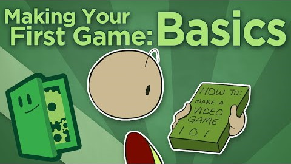

This is a list of resources OGPC recommends. If you are an experienced game developer, you may
already have favorite tools and resources, but it is worth a quick scan to see if there is
something you hadn’t heard of. If you are new to making games, these resources should help you
get up and running. There are more useful tools and sites than we can possible catalog, and there
are always new tools being created, so teams are also encouraged to do additional research before
making any decisions about what tools and resources to use.

---

[Game Engines](#game-engines){: .btn .btn-dark}

[Programming](#programming){: .btn .btn-dark}

[Game Design](#game-design){: .btn .btn-dark}

[Story Tools](#story){: .btn .btn-dark}

[Project Management](#project-management){: .btn .btn-dark}

[Art Tools](#art){: .btn .btn-dark}

[Sound Tools](#sound){: .btn .btn-dark}

[Video Tools](#video){: .btn .btn-dark}

---

## Game Engines

Many teams at OGPC (especially those starting out) rely on a tool that is designed to help speed
up game development. While experienced programmers may enjoy the challenge and experience of
coding a game from scratch, it is not an easy task. Even professionals often rely on a game engine
that handles many of the low-level details of running the game, freeing them up to focus on
implementing the mechanics of their particular game.

### 2D vs 3D

Everything about developing a 2D game tends to be easier. From the art to the coding to the level
design, there is just less to worry about. First time teams are STRONGLY recommended to make a 2D
game before trying to move on to 3D.

### BASIC ENGINES – DRAG AND DROP CODING

#### [CONSTRUCT 3](https://www.construct.net/en)

*Free trial is feature limited – classroom use requires paid license;
paid Full Version; Windows/Mac/Linux/iOS/Android/ChromeOS*

Construct is an HTML5-based 2D game editor that runs in a browser. Because it is browser-based, it
can be used to edit games on any platform with a browser. Game logic can be built using a visual
editing system or with javascript code.

#### [STENCYL](http://www.stencyl.com/)

*Free for personal use – classroom use requires paid license;
paid version to target desktop or mobile; Windows/Mac/Linux*

Stencyl allows students to start to make a game with minimal programming by using predefined
behaviors – first-time designers can just tell an object “you obey gravity” and it will start
behaving according to prebuilt rules. Thus, if what a team wants to do is already supported by
built-in behaviors, they will likely get farther faster. There is, however, a significant difficulty
jump if custom behaviors are necessary. Code can be customized with either a drag and drop syntax
that looks a lot like that of Scratch, or a text-based programming language.

#### [GAMEMAKER](https://gamemaker.io/en/gamemaker)

*Free for personal use – classroom use requires paid license;
Windows/Mac/Linux; Chromebook Coming Soon*

GameMaker is a popular tool for making 2D games. New programmers can use the visual scripting
system to start programming a game without writing code while experienced programmers can go
under the hood to use the written scripting language.

Exporting a project to a web playable version requires a paid upgrade.

#### [SCRATCH](https://scratch.mit.edu/)

*Free Web-based*

Scratch is designed to teach the basics of programming logic and problem solving using drag and
drop coding. Although it can be used to create games, it was not designed for this purpose and
thus there are some significant limitations (screen is a fixed size, projects can only be played
on the web, et cetera) and some things that are “built-in” to more game-focused tools, need to
be coded manually in Scratch.

### ADVANCED ENGINES

#### [GODOT](https://godotengine.org/)

*Free Windows/Mac/Linux*

Godot is an Open Source game engine for 2D and 3D games that allows for coding in a visual
scripting system or C#. Although it doesn’t have all the features of Unity, its 2D engine
has a reputation for being easier to use than Unity’s 2D system.

#### [UNITY](https://unity.com/)

*Free Windows/Mac/Linux*

Unity is a popular commercial/indie development environment and also popular among OGPC teams
making the jump to 3D (though it can also be used for 2D). The Unity community is quite large
and more experienced teams can find lots of help on their forums. Unity is programmed using
JavaScript or C# and games can be exported to a variety of platforms.

#### UNREAL ENGINE/CRY ENGINE/SOURCE ENGINE

There are many other professional game engines that are available for free or at a reasonable
cost. Often, programmers will need to know languages such as C/C++ and teams will need to have
a very good grasp on programming and game design to make effective use of these tools.

[Back to top](#categories){: .btn .btn-dark }

---

## PROGRAMMING

There are an increasing number of “learn to code” websites. Many of them offer high quality,
interactive tutorials in a particular programming language. Also, most programming languages
have web based communities which provide tutorials and support. We cannot possibly list all
the resources, and chances are, if teams are thinking about programming a game from scratch,
they already know of some resources. But here are a few good ones for teams looking to start
learning how to program.

### Resources
{: .visually-hidden}

#### [CODE.ORG](http://studio.code.org/)

Code.org is an organization dedicated to exposing more students to coding. The code.org
studio provides self-paced lessons that teach the basic logic of programming (often using
game-like problems). It is a great place for teams with no programming experience to learn
the basic skills they will need to code a game. It uses a block-based visual programming
language that transfers well to tools like Scratch and Stencyl.

#### [KAHN ACADEMY](https://www.khanacademy.org/computing/computer-programming#programming)

Khan Academy has a well-done series of interactive programming lessons that focus on
Javascript. For students looking to learn text based programming, this is a great place to
start.

Javascript can be used directly in some game engines. But even if your tool uses another
programming language, most of the concepts you learn in Javascript will translate directly
to whatever language you are using.

#### [YOUTUBE](https://www.youtube.com/)

Whatever tools you are using, you can probably find tutorials on YouTube.

[Back to top](#categories){: .btn .btn-dark}

---

## Game Design

Learning how to design a game is just as critical in OGPC as learning to use the tools that
can help realize a design. Teams need to learn how to set goals that are manageable and design
games in terms of their most important feature – player interaction. Here are some resources to help:

### Resources
{: .visually-hidden}

#### [OGPC GAMESTORMING](gamestorming)

A card game where you brainstorm about game design! [Check it out here](gamestorming).

#### [BAFTA Game Idea Generator](https://ygd.bafta.org/resources/game-idea-generator)

An app that generates random ideas for games. [Give it a try.]([gamestorming](https://ygd.bafta.org/resources/game-idea-generator)).

#### [Game For Change Game Design Curriculum](https://gamesforchange.org/studentchallenge/teachers-resources/)

[Games for Change](https://gamesforchange.org/studentchallenge/) is an online national game design competition. They have a [free, platform agnostic curriculum](https://gamesforchange.org/studentchallenge/teachers-resources/) for teaching game design.

#### [EXTRA CREDITS](https://www.youtube.com/user/ExtraCreditz)

{: .float-md-end .col-md-4 .ms-md-2}

Hands down, one of the best resources out there for learning about designing games is the web
series Extra Credits. They have 12+ seasons of episodes that cover a wide range of topics.
[This playlist](https://www.youtube.com/playlist?list=PLjCY8StB1MxNkr-T3_ZGQ0o2dx7cWpz1N) contains
some of the videos that we think provide the most bang for the buck for beginning designers. The
first 4 videos especially should be considered mandatory viewing!
{: .clearfix }

#### [GAME MAKER’S TOOLKIT](https://www.youtube.com/user/McBacon1337/featured)

A Youtube channel that focuses on deconstructing games to figure out what makes then work (or not).

[Back to top](#categories){: .btn .btn-dark}

---

## STORY

### Story Telling

Storytelling can take many forms in video games - from subtle hints in the environment
to cut scenes full of movie style dialog. These resources explore the art of storytelling
in games.

#### [Extra Credits](https://www.youtube.com/watch?v=wNNXdoj7cCQ)

Many of the Extra Credits videos focus on story telling and narrative in game design. Start with
this one and then browse through their archives.

#### [Game Maker's Toolkit](https://www.youtube.com/watch?v=RwlnCn2EB9o)

The Game Maker's Toolkit Youtube channel also covers storytelling - especially in the ways that
level design can tell or reinforce a story. Start with this video.

### Story Tools

Looking for a way to organize your ideas about characters and the world they inhabit?
Google docs and google sheets will do a pretty good job of letting you keep track of information
about the world you are building. But if you are getting serious about writing stories,
you may want to check out a professional tool for tracking everything in the world you
are creating.

#### [Scrivener](https://www.literatureandlatte.com/scrivener/overview)

*Paid Windows/Mac/iOS*

A powerful tool for creative writers to do world building with.

[Back to top](#categories){: .btn .btn-dark}

---

## Project Management

On a complex project it can be hard to keep track of all the things that need to get done,
who is working on each one, and all of your files. A shared google drive folder is a good
way to start, but if your project is more complex, you may benefit from professional grade
tools.

### Project Planning

Kanban boards are a popular and simple system for tracking items your team is working on.
If you do most of your work together in the same room, you can make physical Kanban boards
as demonstrated in [this video that introduces how Kanban works at a basic level](https://www.youtube.com/watch?v=7MDWfAsrrtw).
If you work from multiple locations, or just want to make your board digital, there are
many tools that allow you to make Kanban boards online.

#### [Github Projects](https://github.com/)

If you are already using Github for managing your code (see below), this is an easy way to add on
project management. Here is a [video tutorial for Github projects](https://www.youtube.com/watch?v=idZyqNIrt84).

#### Project Management Suites

If  you want to try out a tool designed for keeping track of projects, these products all have free tiers
that would work for OGPC projects:

* [trello](https://trello.com/)
* [jira](https://www.atlassian.com/software/jira/)
* [asana](https://asana.com/)
* [clickup](https://clickup.com/)

### File Management

If you have a lot of text based code files for your game, you may benefit from storing
it in **source control**.

#### [Github](https://github.com/)

[Git](https://git-scm.com/) is a tool for managing the code for projects. It makes it easier
to track changes to the code - essentially allowing you to store "checkpoints" in the code
so you can easily go back and look at or restore earlier versions of your code.

Github is a website that allows you to set up an online copy of your code using git. This
makes it easy for everyone on the team to collaborate on the same code base.

[Back to top](#categories){: .btn .btn-dark}

---

## ART

Sprites, music, animations, and textures are the essential ingredients that turn a
vision into reality for the player. Here are a few resources to get teams started:

### Tools

#### [PISKEL](https://www.piskelapp.com/)

*Free Web-based*

A handy simple sprite editor specialized for making the kind of graphics used in 2D games.
It makes creating animated sprites much easier than traditional painting programs. It is
browser based, so students can work on any computer and save work to the cloud until they
are ready to export it to work with locally.

#### [KRITA](https://krita.org/en/)

*Free Windows/Mac/Linux*

A free and open-source painting program. Painting software is most commonly used for
concept art and textures, but may be useful for other purposes depending on the art style
of your game.

#### [INKSCAPE](https://inkscape.org/)

*Free Windows/Mac/Linux*

InkScape is a free, open-source vector graphics tool. Vector graphics allow images to be
defined as a set of shapes defined by curves. While less intuitive than “painting” a bitmap,
creating art this way allows it to be resized without becoming distorted. Not all game engines
support the vector format, but images can be exported to JPG/PNG as needed.

#### [BLENDER](https://www.blender.org/)

*Free Windows/Mac/Linux* 

A free and open-source 3D modeling, animation, and rendering engine. Learning to use it will take
some time, but it is capable of producing professional results.

### Graphics Assets

We strongly encourage teams to create their own art and sounds but this may not always be possible.
In the event that a team cannot make their own assets, teams can use publicly available, free,
properly licensed (creative commons or other open licensed) assets. Teams need to keep a log of
where they acquire resources from and include that in their documentation.

#### [OPENGAMEART.ORG](https://opengameart.org/)

This site provides lots of assets including 2D/3D art, music, and sound effects. All of the assets
are released under various open-source licenses.

#### [KENNEY.NL](https://kenney.nl/assets/)

A website with creative commons assets packs for games. The graphics packs are available for free,
but it is permissible to donate to kenney.nl if you use assets from the site.

#### [THENOUNPROJECT.COM](https://thenounproject.com/)

Icons and graphics that are available under open licenses. (They generally require attribution –
make sure to document who created each of the assets!)

[Back to top](#categories){: .btn .btn-dark}

---

## SOUND

### Sound Tools

#### [JSFXR](http://github.grumdrig.com/jsfxr/)

*Free Web-based*

JSFXR is a web-based tool that allows teams to generate basic sound effects. It has preset
categories like “pickup” and “jump” and simple customization of sounds via sliders. With
many sliders and options, teams have a huge amount of control over the sound being generated.

#### [AUDACITY](https://www.audacityteam.org/)

*Free Windows/Mac/Linux*

Audacity is a free, multitrack audio editor and recorder. If teams need to record sound
effects, change audio formats, or layer multiple sounds together, Audacity is the tool to use.

#### [AUDIOTOOL.COM Studio](https://studio.audiotool.com/)

*Free Web-based*

AudioTool.com allows you to compose, mix, and sequence sound and music.
It supports MIDI input, a variety of instruments, and a visualizer/spectrum analyzer.

### Sound Assets

We strongly encourage teams to create their own art and sounds but this may not always be possible.
In the event that a team cannot make their own assets, teams can use publicly available, free,
properly licensed (creative commons or other open licensed) assets. Teams need to keep a log of
where they acquire resources from and include that in their documentation.

#### [FREESOUND.ORG](http://www.freesound.org/)

A large and ever-expanding list of sounds and music licensed under Creative Commons licenses.
Sounds and music could be professional or amateur but will always be free. Sounds come in a variety
of file formats to fit teams’ needs.

[Back to top](#categories){: .btn .btn-dark}

---

## Video

As part of their submission, teams need to produce videos. Here are some recommended tools
for recording and editing those.

### VIDEO RECORDING

#### [WINDOWS GAME BAR](https://www.howtogeek.com/219947/how-to-record-pc-gameplay-with-windows-10%E2%80%99s-game-dvr-and-game-bar/)

Windows Game Bar is built into Windows 10 and can record footage of your project.

#### [MAC SCREEN RECORDING TOOL](https://support.apple.com/en-us/HT208721)

On a Mac you can record video of your screen using this built-in tool.

#### [SCREENCASTIFY FOR CHROME](https://www.screencastify.com/)

On any platform with the Chrome browser, you can use screencastify to record video.
(Up to 5 minutes at a time with the free version).

#### [OPEN BROADCASTER SOFTWARE](https://obsproject.com/)

*Free Windows/Mac/Linux*

A more powerful (and complex option) is Open Broadcaster Software. Here is a tutorial for it:
[OBS YouTube Tutorial](https://www.youtube.com/watch?v=r7teWxV5BCE).

### VIDEO EDITING

#### [ADOBE EXPRESS](https://express.adobe.com/)

Adobe Express is a free tool for editing simple videos. It runs on the web and can be used from
any platform. Use the Slideshow template to make a project that you can export as a video.
You can then mix together footage that you have recorded, as well as add title screens,
narration, and effects.

#### ADVANCED TOOLS

Teams that want to dive deeper into video editing can check out either iMovie for Macs or
Lightworks for PC.

[Back to top](#categories){: .btn .btn-dark}